<p align="right"><b>🇫🇷 Français</b> · <a href="README-EN.md">🇬🇧 English</a></p>

<div align="center">

# mcp-pennylane

**Pilotez votre compta Pennylane depuis Claude — factures, journal, banque, FEC**

<br/>



<br/>
<br/>

[](https://crates.io/crates/mcp-pennylane)
[](https://crates.io/crates/mcp-pennylane)
[](LICENSE)
[](https://github.com/FGRibreau/mcp-pennylane/actions/workflows/ci.yml)
[](https://rust-lang.org)
[](https://modelcontextprotocol.io)

</div>

---

## Sponsors

<table>
  <tr>
    <td align="center" width="175">
      <a href="https://france-nuage.fr/?mtm_source=github&mtm_medium=sponsor&mtm_campaign=france-nuage&mtm_content=mcp-pennylane">
        <br/>
        <b>France-Nuage</b>
      </a><br/>
      <sub>Cloud souverain français pour héberger vos exports comptables et archives FEC.</sub>
    </td>
    <td align="center" width="175">
      <a href="https://hook0.com/?mtm_source=github&mtm_medium=sponsor&mtm_campaign=hook0&mtm_content=mcp-pennylane">
        <br/>
        <b>Hook0</b>
      </a><br/>
      <sub>Diffusez les webhooks Pennylane comme événements signés vers votre back-office.</sub>
    </td>
    <td align="center" width="175">
      <a href="https://getnatalia.com/?mtm_source=github&mtm_medium=sponsor&mtm_campaign=natalia&mtm_content=mcp-pennylane">
        <br/>
        <b>Natalia</b>
      </a><br/>
      <sub>Agent vocal IA qui répond aux appels fournisseurs et clients sur les factures.</sub>
    </td>
    <td align="center" width="175">
      <a href="https://www.netir.fr/?mtm_source=github&mtm_medium=sponsor&mtm_campaign=netir&mtm_content=mcp-pennylane">
        <br/>
        <b>Netir</b>
      </a><br/>
      <sub>Recrutez des comptables et finance ops freelances français vérifiés.</sub>
    </td>
  </tr>
  <tr>
    <td align="center" width="233">
      <a href="https://nobullshitconseil.com/?mtm_source=github&mtm_medium=sponsor&mtm_campaign=nbc&mtm_content=mcp-pennylane">
        <br/>
        <b>NoBullshitConseil</b>
      </a><br/>
      <sub>Conseil finance ops et ERP sans bullshit. Spécialiste des intégrations Pennylane.</sub>
    </td>
    <td align="center" width="233">
      <a href="https://qualneo.fr/?mtm_source=github&mtm_medium=sponsor&mtm_campaign=qualneo&mtm_content=mcp-pennylane">
        <br/>
        <b>Qualneo</b>
      </a><br/>
      <sub>LMS Qualiopi pour formateurs français, avec exports de facturation prêts pour Pennylane.</sub>
    </td>
    <td align="center" width="233">
      <a href="https://www.recapro.ai/?mtm_source=github&mtm_medium=sponsor&mtm_campaign=recapro&mtm_content=mcp-pennylane">
        <br/>
        <b>Recapro</b>
      </a><br/>
      <sub>IA privée pour transcrire vos rendez-vous comptables et rédiger les comptes-rendus on-prem.</sub>
    </td>
  </tr>
</table>

> **Envie de devenir sponsor ?** [Contactez-nous](mailto:rust@fgribreau.com)

---

## C'est quoi ?

`mcp-pennylane` connecte Claude (ou n'importe quel hôte MCP) à l'[API Pennylane Company v2](https://pennylane.readme.io). Environ 72 opérations essentielles sont exposées directement à l'hôte, et deux méta-outils (`pennylane_search_tools`, `pennylane_execute`) couvrent la longue traîne — la totalité des 163 opérations reste donc utilisable sans saturer le budget d'outils du client MCP.

Pilotez votre compta depuis un chat : lister et créer des factures clients, rapprocher des transactions bancaires, interroger le grand livre, générer les exports FEC pour votre expert-comptable, gérer les mandats GoCardless et SEPA — le tout en langage naturel.

## Fonctionnalités

- ✨ **Toutes les 163 opérations Pennylane** — 72 essentielles directement + `pennylane_search_tools` + `pennylane_execute` pour la longue traîne
- 🔒 **Auto-détection du mode lecture seule** — interroge `GET /me` au démarrage, force le readonly si chaque scope du token finit par `:readonly`
- ⚡ **Deux transports** — stdio pour Claude Desktop, HTTP streamable pour le distant (`/mcp` + `/health`)
- ⚙️ **Codegen via OpenAPI** — `build.rs` parse la spec vendorisée, fail-fast si la whitelist dérive
- 🤖 **Auto-PR hebdomadaire** — une GitHub Action diffe l'upstream tous les lundis et ouvre une PR si la spec a bougé
- 🛡️ **Token redacté** — `Bearer abcd***wxyz` sur tous les chemins de log, les bodies comptables jamais loggés en INFO
- 💡 **Erreurs structurées** — `UNAUTHORIZED`, `VALIDATION_FAILED`, `RATE_LIMITED`, … avec body upstream tronqué et hint actionnable
- 📦 **Binaire statique unique** — `cargo install`, GitHub Releases (linux/macOS/windows × x86_64/aarch64), tap Homebrew

## Démarrage rapide

```bash
# 1. Installer
cargo install mcp-pennylane

# 2. Générer un token Pennylane dans Paramètres → Connectivité → Développeurs
#    Scope recommandé : « Lecture seule — récupérer les données »
export PENNYLANE_API_KEY="votre-token-pennylane"

# 3. Brancher dans Claude Desktop, puis redémarrer Claude
cat <<'EOF' >> ~/Library/Application\ Support/Claude/claude_desktop_config.json
{
  "mcpServers": {
    "pennylane": {
      "command": "/usr/local/bin/mcp-pennylane",
      "env": { "PENNYLANE_API_KEY": "votre-token-pennylane" }
    }
  }
}
EOF
```

C'est tout — Claude voit maintenant `getMe`, `getCustomers`, `pennylane_search_tools`, et 70+ autres outils.

> 💡 Le serveur interroge `GET /me` au démarrage. Si votre token est en lecture seule, il active automatiquement le mode readonly (la bannière affiche `mode=readonly (auto)`). Définissez `PENNYLANE_READONLY=true` pour ignorer la sonde et forcer le readonly de manière déterministe (recommandé en CI).

## Configuration

### Variables d'environnement

| Variable | Défaut | Rôle |
|---|---|---|
| `PENNYLANE_API_KEY` | *requis* | Token Bearer (Paramètres → Connectivité → Développeurs) |
| `PENNYLANE_BASE_URL` | `https://app.pennylane.com` | Override pour proxy ou éventuelle URL régionale |
| `PENNYLANE_READONLY` | *(auto-détecté)* | `true` / `false` pour court-circuiter la sonde `/me` |
| `PENNYLANE_ENV` | `production` | `production` / `sandbox` — repère visuel dans la bannière et dans `getMe` |
| `PENNYLANE_API_2026` | `false` | Envoie l'en-tête `X-Use-2026-API-Changes: true` (phase preview) |
| `MCP_PENNYLANE_TRANSPORT` | `stdio` | `stdio` ou `http` |
| `RUST_LOG` | `info` | Filtre standard `tracing-subscriber` |

### Flags CLI

Chaque variable d'environnement a un `--flag` équivalent (`--token`, `--base-url`, `--readonly`, `--env`, `--api-2026`, `--transport`, `--host`, `--port`, `--log-level`). Lancez `mcp-pennylane --help` pour la liste complète.

## Installation

| Canal | Commande |
|---|---|
| crates.io | `cargo install mcp-pennylane` |
| Homebrew | `brew install fgribreau/tap/mcp-pennylane` |
| GitHub Releases | [Télécharger l'archive](https://github.com/FGRibreau/mcp-pennylane/releases/latest) (linux/macOS/windows × x86_64/aarch64) |

## Utilisation

Trois workflows de bout en bout que vous pouvez piloter depuis Claude :

**1. Lister les factures impayées récentes.** *« Montre-moi mes factures clients impayées des 30 derniers jours. »* → Claude appelle `getCustomerInvoices` avec un filtre du type `[{"field":"status","operator":"eq","value":"unpaid"},{"field":"date","operator":"gteq","value":"2026-04-06"}]`, parcourt la pagination via `next_cursor` si nécessaire.

**2. Rapprocher une transaction bancaire.** *« Trouve une transaction de 1 250 € non rapprochée cette semaine et lie-la à la bonne facture. »* → Claude appelle `getTransactions`, puis `pennylane_search_tools(query="match")` pour découvrir l'opération de rapprochement, puis `pennylane_execute(tool_name="postCustomerInvoiceMatchedTransactions", params={"id": <id_facture>, "transaction_id": <id_tx>})`.

**3. Générer un FEC pour le T1 2026.** *« Génère le FEC de janvier à mars 2026 et préviens-moi quand il est prêt. »* → Claude appelle `exportFec` avec `{"start_date":"2026-01-01","end_date":"2026-03-31"}`, polle `getFecExport` jusqu'à ce que le statut passe à `done`, puis renvoie l'URL de téléchargement.

## Mode lecture seule

`mcp-pennylane` résout la posture readonly en deux temps :

1. **Auto-détection** (par défaut) — quand `PENNYLANE_READONLY` n'est pas défini, le serveur interroge `GET /me` une fois au démarrage, lit le tableau `scopes` du token, et force le readonly **uniquement si** chaque scope finit par `:readonly`. La bannière affiche `mode=readonly (auto)` ou `mode=read+write (auto)`.
2. **Override explicite** — `PENNYLANE_READONLY=true` (ou `false`) court-circuite complètement la sonde. Bannière : `mode=… (explicit)`. Utile en CI pour un démarrage déterministe.

Quelle que soit l'origine, lorsque le readonly est actif, les opérations d'écriture sont filtrées au moment de l'enregistrement ET `pennylane_execute` renvoie une erreur structurée `READONLY_MODE` avant tout appel HTTP vers Pennylane.

```bash
# Defense-in-depth : explicite + scope du token Pennylane en lecture seule
export PENNYLANE_API_KEY=…                # token créé avec « Lecture seule »
export PENNYLANE_READONLY=true            # filtre serveur explicite
mcp-pennylane
```

Le scope du token Pennylane est le radio bouton à la création du token dans **Paramètres → Connectivité → Développeurs**. Une couche protège contre un serveur mal configuré, l'autre contre un token mal configuré.

## Logs et confidentialité

- Les logs sortent **uniquement sur stderr** — jamais sur stdout, ce qui corromprait le framing MCP du transport stdio.
- Le token Pennylane Bearer est **toujours redacté** via `redact_bearer()` (`Bearer abcd***wxyz`), même en niveau TRACE.
- Les niveaux INFO / WARN / ERROR **n'incluent jamais les bodies de réponse** — la donnée comptable est sensible (RGPD, secret des affaires).
- TRACE expose les URLs de requête complètes et les bodies de réponse. À n'activer qu'en debug local sur un compte sandbox.
- Aucune télémétrie, aucun phone-home, aucune instrumentation opt-in.

## Transport HTTP streamable

```bash
mcp-pennylane --transport http --host 127.0.0.1 --port 8000
# Endpoint MCP : http://127.0.0.1:8000/mcp
# Health        : http://127.0.0.1:8000/health
```

Le token Pennylane reste dans `PENNYLANE_API_KEY` côté serveur — l'instance est mono-tenant par processus. **L'authentification entre le client MCP et ce serveur est volontairement absente.** Bindez sur `127.0.0.1` et placez un reverse proxy devant pour toute exposition non locale (Cloudflare Access, Authelia, Caddy basic-auth, etc.). Un serveur OSS standalone ne doit pas figer d'opinions sur l'auth externe.

## Sandbox

`PENNYLANE_ENV=sandbox` est un **repère visuel uniquement** — Pennylane utilise la même URL de base pour le sandbox et la production. La valeur est exposée à trois endroits pour éviter le classique « oups, j'ai modifié la prod » :

1. La bannière de démarrage sur stderr : `mcp-pennylane v0.1.0 — Pennylane Company API v2.0 — env=sandbox — mode=readonly (auto)`.
2. La réponse `getMe`, augmentée de `_mcp_pennylane = { env, server_version, spec_version, readonly, readonly_source, api_2026 }`.
3. Le champ `serverInfo.instructions` du protocole MCP.

## Breaking changes API 2026

Pennylane déploie des breaking changes sur son Company API le **8 avril 2026**. Du 14 janvier au 8 avril 2026, le nouveau comportement est opt-in via `X-Use-2026-API-Changes: true`. Définissez `PENNYLANE_API_2026=true` (ou `--api-2026`) pour envoyer l'en-tête dès maintenant.

| Phase | Quand | Comportement |
|---|---|---|
| Preview | 14 janvier → 8 avril 2026 | Opt-in via la variable d'env |
| Bascule | 8 avril 2026 | Le nouveau comportement devient la valeur upstream par défaut. **v1.0** taggué ce jour-là, la variable devient opt-out / legacy |
| Nettoyage | 1er juillet 2026 | L'ancien comportement est retiré upstream — la variable devient un no-op |

## Catalogue d'outils

Environ 72 outils essentiels sont exposés directement : clients, fournisseurs, factures clients + fournisseurs, produits, devis, banque, journaux, comptes/écritures/lignes du grand livre, balance de vérification, exercices fiscaux, catégories analytiques, exports FEC, pièces jointes, changelogs, mandats GoCardless et SEPA, `getMe`. La totalité des ~163 opérations reste accessible via les méta-outils.

Les noms des outils correspondent à l'`operationId` Pennylane à l'identique (par ex. `getCustomerInvoices`, `postLedgerEntries`), pour grepper proprement contre la spec OpenAPI officielle. La liste curée vit dans la [constante `ESSENTIALS` de `server/build.rs`](./server/build.rs).

## Roadmap

- API Firm Pennylane comme binaire frère `mcp-pennylane-firm`
- Image Docker quand l'usage du transport HTTP le justifiera

## Développement

```bash
# Build
cargo build --release

# Rafraîchir la spec OpenAPI Pennylane vendorisée
cargo run -p refresh-openapi
cargo run -p refresh-openapi -- --diff   # dry run
cargo run -p refresh-openapi -- --check  # exit non-zero en cas de drift

# Suite de tests (unit + invariant)
cargo test --workspace

# Tests d'intégration contre un sandbox Pennylane (lecture seule)
PENNYLANE_API_KEY=… PENNYLANE_READONLY=true cargo test --workspace --features integration-tests
```

Une GitHub Action hebdomadaire lance `cargo run -p refresh-openapi` chaque lundi à 06h00 UTC et ouvre une PR si la spec upstream a dérivé. La CI sur la PR vérifie que toutes les opérations essentielles sont toujours présentes (`build.rs` panique si une op renommée/retirée casse le contrat) ; mergez quand le vert est là.

## Licence

MIT — voir [LICENSE](LICENSE).
